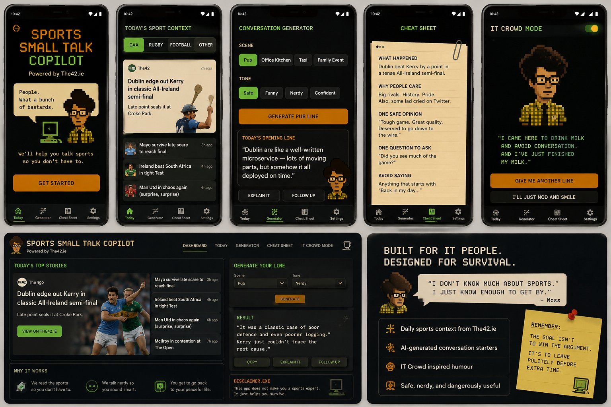
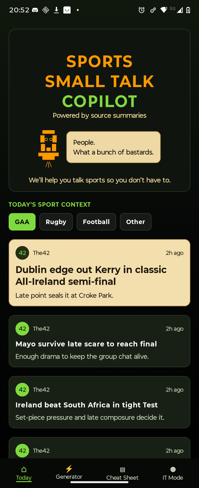
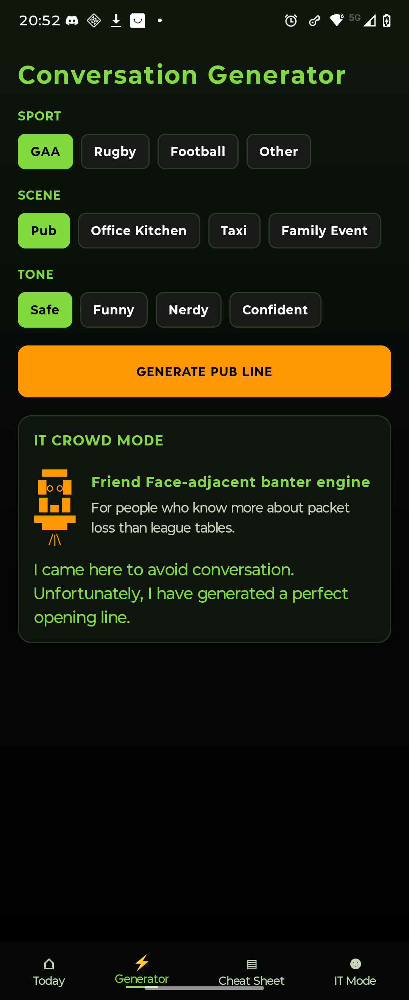
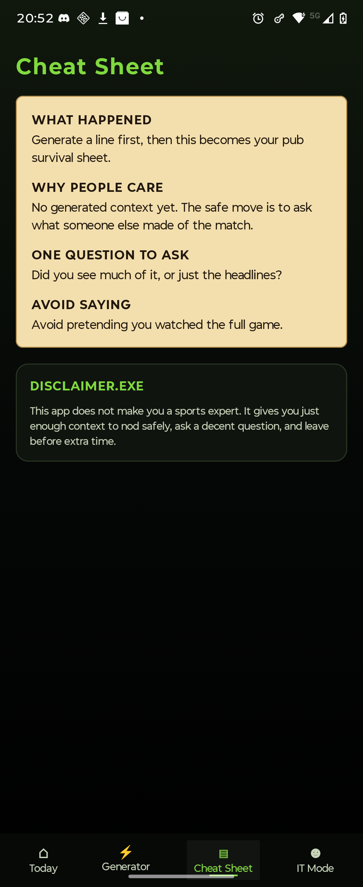
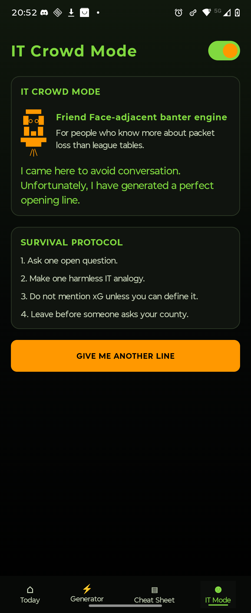

# Sports Small Talk Copilot

A retro terminal Android app and companion web mockup for technical people who want enough sports context to survive a pub, office, taxi, or family conversation without pretending to be a pundit.

The UI direction is deliberately fun: dark CRT styling, amber/green terminal colours, paper cheat sheets, bottom navigation, and light UK IT-sitcom references. It does not ship copyrighted images, logos, or character assets.

## What is included

- `android/` — Kotlin + Jetpack Compose Android app
- `backend/` — FastAPI service that normalises sports source facts and generates conversation starters
- `web/` — static landing/dashboard mockup matching the Android visual language
- `docs/mockups/first-ui-direction.png` — the first visual mockup used as the design target

## App features

- Retro terminal/CRT visual system
- Bottom navigation:
  - Today
  - Generator
  - Cheat Sheet
  - IT Mode
- Sport categories: GAA, Rugby, Football, Other
- Context modes: Pub, Office Kitchen, Taxi, Family Event
- Tone modes: Safe, Funny, Nerdy, Confident
- Generated output:
  - opening line
  - IT analogy
  - 30-second explainer
  - safe follow-up question
  - avoid saying
- Friend Face-adjacent / IT Crowd-inspired humour layer
- Source-aware backend output
- Mock backend with deterministic fallback
- Optional OpenAI-compatible API support

## Repo structure

```text
sports-smalltalk-copilot/
├── android/
│   ├── app/
│   │   ├── build.gradle.kts
│   │   └── src/main/
│   │       ├── AndroidManifest.xml
│   │       └── java/com/example/sportssmalltalk/
│   │           ├── MainActivity.kt
│   │           ├── data/ApiModels.kt
│   │           ├── data/SportsApi.kt
│   │           ├── data/SportsRepository.kt
│   │           ├── ui/App.kt
│   │           ├── ui/Components.kt
│   │           ├── ui/theme/Theme.kt
│   │           └── vm/MainViewModel.kt
│   ├── build.gradle.kts
│   ├── settings.gradle.kts
│   └── gradle.properties
├── backend/
│   ├── app/
│   │   ├── main.py
│   │   ├── models.py
│   │   ├── llm.py
│   │   ├── sources.py
│   │   └── prompt_templates.py
│   ├── requirements.txt
│   └── .env.example
├── web/
│   ├── index.html
│   ├── styles.css
│   └── script.js
└── docs/
    ├── product-plan.md
    ├── legal-and-data-notes.md
    └── mockups/first-ui-direction.png
```

## Run the backend

```bash
cd backend
python3 -m venv .venv
source .venv/bin/activate
pip install -r requirements.txt
uvicorn app.main:app --reload --host 0.0.0.0 --port 8000
```

Test:

```bash
curl http://localhost:8000/health
curl http://localhost:8000/sources
curl -X POST http://localhost:8000/generate \
  -H 'Content-Type: application/json' \
  -d '{"sport":"GAA","setting":"Pub","tone":"Nerdy"}'
```

## Run the Android app

Open `android/` in Android Studio.

For emulator, the backend URL defaults to:

```text
http://10.0.2.2:8000
```

For a physical phone on the same Wi-Fi, change `BASE_URL` in:

```text
android/app/src/main/java/com/example/sportssmalltalk/data/SportsApi.kt
```

Example:

```kotlin
private const val BASE_URL = "http://192.168.1.50:8000"
```

## Run the web mockup

No build step is required:

```bash
cd web
python3 -m http.server 5173
```

Open:

```text
http://localhost:5173
```

## Screenshots

### UI Direction Mockup



### Android App Screens






## Optional LLM configuration

The backend works without a remote LLM. To use an OpenAI-compatible endpoint:

```bash
export LLM_PROVIDER=openai_compatible
export LLM_BASE_URL=https://api.openai.com/v1
export LLM_API_KEY=YOUR_KEY
export LLM_MODEL=gpt-4.1-mini
```

For local models, point `LLM_BASE_URL` at an OpenAI-compatible server such as LM Studio, Ollama with OpenAI compatibility, vLLM, or llama.cpp server.

## Data and legal notes

Do not scrape or redistribute full publisher articles. Keep production source records limited to:

- title
- source name
- source URL
- publication timestamp
- short factual summary
- category/sport

Every generated card should show source names and links. Add a visible disclaimer in production:

```text
Generated from source summaries. Check linked sources for full context.
```

## Design note

The app can reference UK IT-sitcom culture as parody/inspiration, but avoid using official logos, stills, actor likenesses, or copied assets. Keep it as a retro terminal comedy product with original pixel art and original copy.
